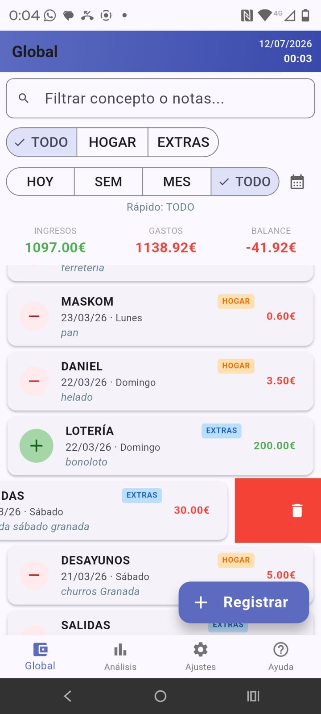
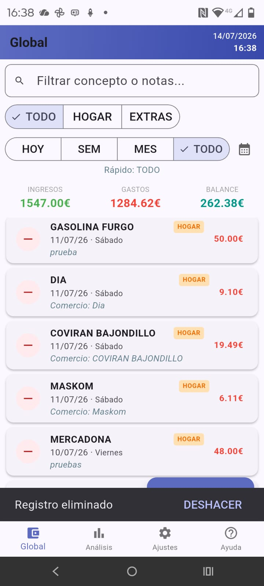
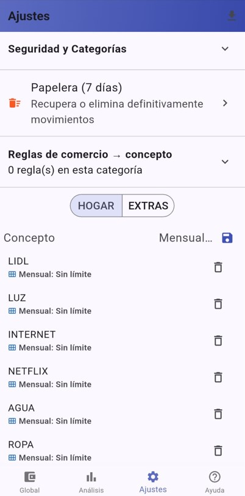
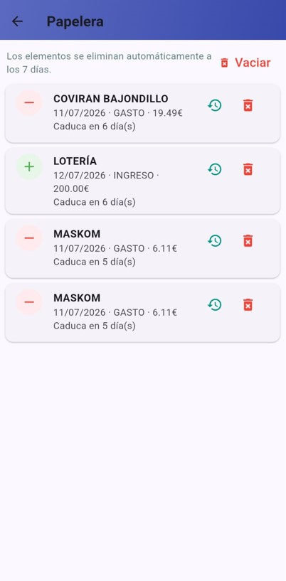

# Smart-Expense-Tracker

A feature-rich Flutter expense tracker featuring smart voice input, OCR processing, interactive analytics, and reactive state management.

## 🚀 Overview

Built with scalability and user experience in mind, this application goes far beyond basic CRUD operations. It acts as a comprehensive personal finance dashboard, offering smart data entry methods and in-depth analytics to help users maintain total control over their economy.

## ✨ Key Features

* **🤖 Smart Data Entry:** Speech-to-text recognition with customizable processing rules and OCR receipt scanning.
* **📊 Advanced Analytics Dashboard:** Interactive comparative bar charts (monthly and weekly). A long-press interaction reveals dynamic daily breakdowns through line charts.
* **🔍 Deep Filtering:** Global search across concepts and notes, combined with custom category tags and date range filters.
* **⚙️ High Customization:** Custom concept management, monthly spending limit settings, and global budget alerts definition.
* **🛡️ Security & Reliability:** Integrated password protection, data export options, and a recycle bin with 7-day recovery for safe management.

## 🛠️ Tech Stack & Development Flow

* **Framework:** Flutter (Dart)
* **Local Storage:** [Hive](https://pub.dev/packages/hive) (Lightweight NoSQL database).
* **State Management:** Native `ValueListenableBuilder` reactive to Hive database mutations.
* **AI & Hardware Integration:**
  * `google_mlkit_text_recognition`: On-device Machine Learning for OCR.
  * `speech_to_text`: Microphone hardware access.
  * Complex Regex algorithms for natural language processing (entities, dates, amounts).
* **Custom UI & Graphics:** Native analytic charts implemented using `CustomPainter` and `InteractiveViewer` for horizontal scrolling.
* **Security & Data Export:** `crypto` (local SHA-256 hashing), `file_saver`, and `share_plus` for CSV generation.
* **🤖 Development Approach:** Designed and programmed in VS Code utilizing **GitHub Copilot** as an AI assistant to accelerate the implementation of complex logic (such as Canvas mathematics and Regex patterns) and boost overall productivity.

## 📱 App Showcase & Key Interactions

### 1. Smart Data Entry (OCR & Voice)
The application leverages on-device AI to eliminate the friction of manual data entry.
* **OCR Receipt Scanner:** Automatically extracts totals and dates from physical receipts using Google ML Kit.
* **Natural Language Processing:** Users can input expenses via voice. The app parses amounts, dates, and context to automatically assign categories and concepts.

> **Note:** Speech-to-text recognition and OCR receipt scanning are considered experimental features. Accuracy may vary based on environmental factors, camera quality, and voice clarity. Continuous optimization of the parsing algorithms is currently underway.

**OCR Scan Demo**  

**Voice Input Demo**  

---

### 2. Advanced Analytics & Custom Charts
A dedicated dashboard built entirely with custom rendering (`CustomPainter`) for high-performance financial tracking.
* **Interactive Filtering:** Instantly toggle between Monthly and Weekly comparative views.
* **In-Depth Details:** A long press on a column reveals a horizontally scrolling line chart with daily breakdowns and dynamic Y-axis scaling.

**Quick Navigation & Filters**  
  

**Interaction: Long Press & Daily Detail**  
  

---

### 3. Comprehensive Management, Settings & Security
Built to be robust, highly customizable, and safe against user errors.
* **Total Control:** Management of concepts, category nomenclature, and automatic rule assignment (Merchant → Concept).
* **Protection & Export:** Encrypted password lock and native CSV format export.
* **Preventive UI:** Swipe-to-delete functionality integrated with warning dialogs and a 7-day recoverable recycle bin system.

<table width="100%" cellspacing="0" cellpadding="0">
  <tr>
    <td width="20%" align="center" valign="top">
      <b>Swipe</b>
      
    </td>
    <td width="20%" align="center" valign="top">
      <b>Confirm</b>
      
    </td>
    <td width="20%" align="center" valign="top">
      <b>Undo</b>
      
    </td>
    <td width="20%" align="center" valign="top">
      <b>Settings</b>
      
    </td>
    <td width="20%" align="center" valign="top">
      <b>Trash</b>
      
    </td>
  </tr>
</table>