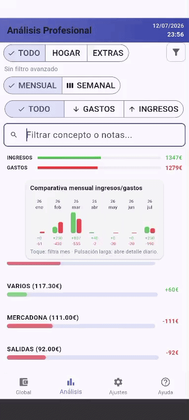
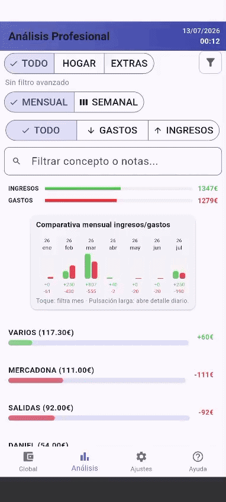

# Smart-Expense-Tracker

Un control de gastos en Flutter rico en funciones, que incluye entrada de voz inteligente, procesamiento OCR, analíticas interactivas y gestión de estado reactiva.

## 🚀 Resumen

Construida teniendo en mente la escalabilidad y la experiencia del usuario, esta aplicación va mucho más allá de las operaciones básicas CRUD. Actúa como un panel integral de finanzas personales, ofreciendo métodos inteligentes de entrada de datos y análisis profundos para ayudar a los usuarios a mantener un control total sobre su economía.

## ✨ Características Principales

* **🤖 Entrada de Datos Inteligente:** Reconocimiento de voz a texto con reglas de procesamiento personalizables y escaneo de tickets mediante OCR.
* **📊 Panel de Analíticas Avanzado:** Gráficos de barras comparativos interactivos (mensuales y semanales). La función de pulsación larga revela desgloses dinámicos diarios mediante gráficos de líneas.
* **🔍 Filtrado Profundo:** Búsqueda global entre conceptos y notas, combinada con etiquetas de categoría personalizadas y filtros por rango de fechas.
* **⚙️ Alta Personalización:** Gestión de conceptos personalizados, establecimiento de límites de gasto mensual y definición de alertas globales de presupuesto.
* **🛡️ Seguridad y Fiabilidad:** Protección con contraseña integrada, opciones de exportación de datos y una papelera de reciclaje con recuperación de 7 días para una gestión segura.

## 🛠️ Stack Tecnológico y Flujo de Desarrollo

* **Framework:** Flutter (Dart)
* **Almacenamiento Local:** [Hive](https://pub.dev/packages/hive) (Base de datos NoSQL ligera).
* **Gestión de Estado:** `ValueListenableBuilder` nativo y reactivo a las mutaciones de la base de datos Hive.
* **Integración de IA y Hardware:**
  * `google_mlkit_text_recognition`: Machine Learning en el dispositivo para OCR.
  * `speech_to_text`: Acceso al hardware del micrófono.
  * Algoritmos Regex complejos para el procesamiento de lenguaje natural (entidades, fechas, importes).
* **UI y Gráficos Personalizados:** Gráficos analíticos implementados de forma nativa usando `CustomPainter` e `InteractiveViewer` para el desplazamiento horizontal.
* **Seguridad y Exportación de Datos:** `crypto` (hash local SHA-256), `file_saver` y `share_plus` para la generación de CSV.
* **🤖 Enfoque de Desarrollo:** Diseñada y programada en VS Code utilizando **GitHub Copilot** como asistente de IA para acelerar la implementación de lógica compleja (como las matemáticas del Canvas y los patrones Regex) y aumentar la productividad general.

## 📱 Escaparate de la App e Interacciones Clave

### 1. Entrada de Datos Inteligente (OCR y Voz)
La aplicación aprovecha la IA en el dispositivo para eliminar la fricción de la entrada manual de datos.
* **Escáner de Tickets OCR:** Extrae automáticamente totales y fechas de recibos físicos usando Google ML Kit.
* **Procesamiento de Lenguaje Natural:** Los usuarios pueden introducir gastos mediante voz. La app analiza cantidades, fechas y contexto para asignar categorías y conceptos automáticamente.

> **Nota:** El reconocimiento de voz a texto y el escaneo OCR de recibos se consideran funciones experimentales. La precisión puede variar según factores ambientales, la calidad de la cámara y la claridad de la voz. Actualmente se está trabajando en la optimización continua de los algoritmos de análisis.

**Demostración Escaneo de Ticket**  

**Demostración Entrada por Voz**  

---

### 2. Análisis Avanzado y Gráficos Personalizados
Un panel dedicado construido completamente con renderizado personalizado (`CustomPainter`) para un seguimiento financiero de alto rendimiento.
* **Filtrado Interactivo:** Alterna entre vistas comparativas Mensuales y Semanales al instante.
* **Detalles en Profundidad:** Una pulsación larga en una columna revela un gráfico de líneas de desplazamiento horizontal con desgloses diarios y escalado dinámico del eje Y.

**Navegación Rápida y Filtros**  

**Interacción: Pulsación Larga y Detalle Diario**  

---

### 3. Gestión Integral, Ajustes y Seguridad
Construida para ser robusta, altamente personalizable y segura ante errores del usuario.
* **Control Total:** Gestión de conceptos, categorías y asignación de reglas automáticas (Comercio → Concepto).
* **Protección y Exportación:** Bloqueo mediante contraseña cifrada y exportación nativa a formato CSV.
* **UI Preventiva:** Funcionalidad de deslizar para borrar (*swipe-to-delete*) integrada con diálogos de advertencia y un sistema de papelera recuperable de 7 días.

**Gestión de Ajustes y Límites**

**Flujo de Borrado y Papelera**

#### Detalles Adicionales de la Interfaz
| Confirmación de Borrado | Diálogo de Registro | Exportación y Cuentas |
| :---: | :---: | :---: |
|  |  |  |
#### Detalles Adicionales de la Interfaz
| Confirmación de Borrado | Ajustes de Usuario | Gestión de Papelera |
| :---: | :---: | :---: |
|  |  |  |